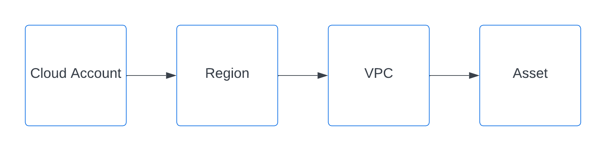
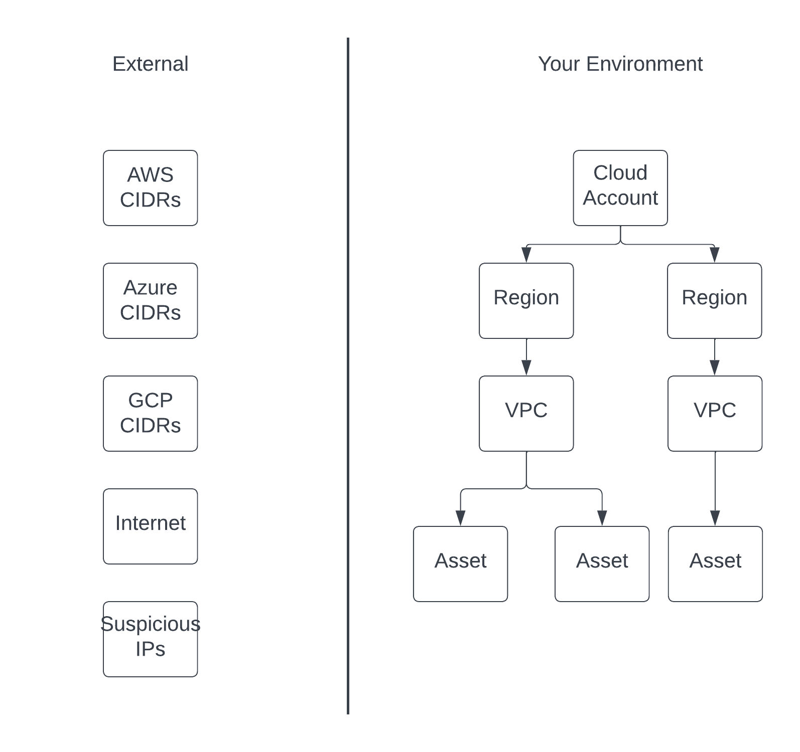
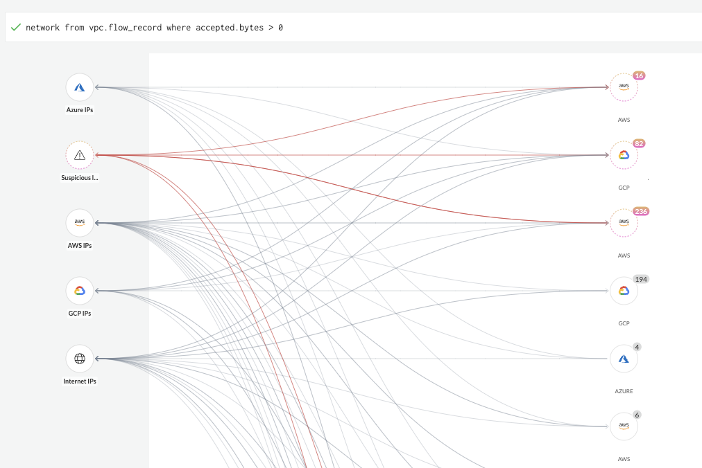
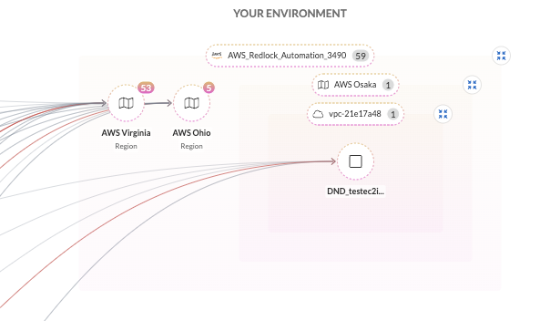
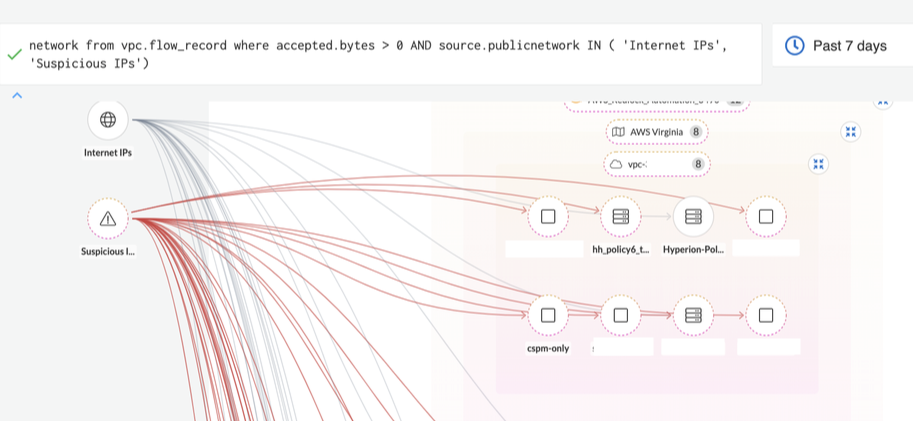
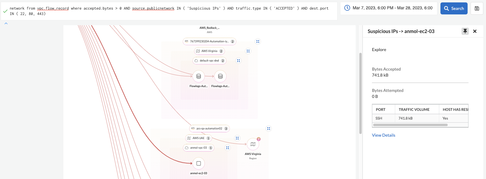
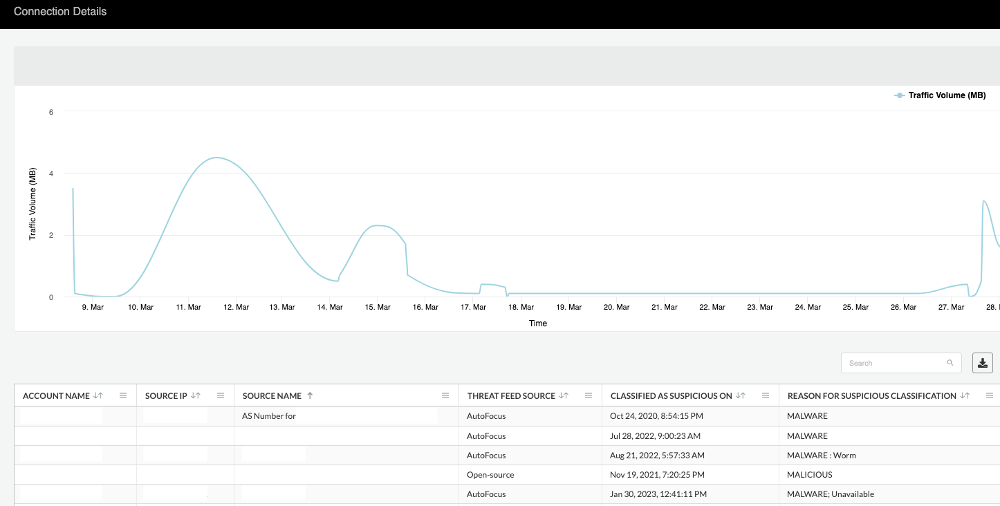
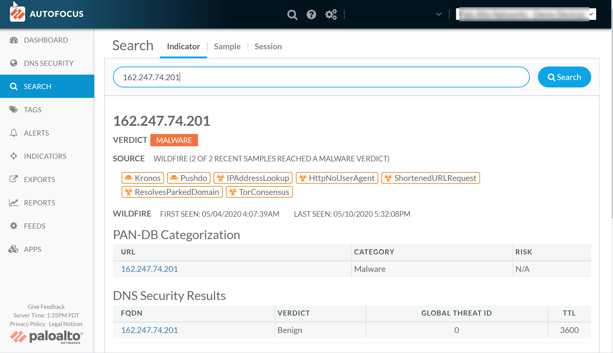
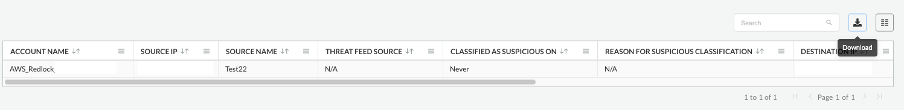

= Performing Network Investigation using Prisma Cloud
Alexandre Cezar <acezar@paloaltonetworks.com> 1.0, April 1, 2022:

== About

Prisma Cloud has the capability to identify ingest and monitor network traffic from cloud services using VPC flow logs. This allows Prisma Cloud to leverage its Machine Learning Engine to identify anomalies and also allows users to use pre-defined queries or create their our custom queries to perform network analysis and investigations.

Prisma Cloud allows users to query network traffic in extensive details and set up conditions that they want to be alerted upon, such as services that are exposed to the Internet, communicating with suspicious IPs or communicating outside of the approved guardrails.

Network queries are of https://docs.paloaltonetworks.com/prisma/prisma-cloud/prisma-cloud-rql-reference/rql-reference/network-query[two types]:

* `VPC flow-logs queries`
* `Cloud Network Configuration queries`

Both use different RQL and data sources; data from VPC flow logs enables you to search for potential network issues with traffic to and from deployed resources, while data from network configuration can identity net effective exposure with path analysis to help you visualize how traffic is allowed or blocked through the cloud resources.

By using packets, bytes, source or destination resource, source or destination IP address, and source or destination port information, these queries enable you to monitor traffic and the interconnectivity of the resources that belong to your cloud accounts and regions.

== Using the Intelligent Network Investigation Graph

By navigating to Investigate and writing `_network from_` queries, users automatically enable the network investigate graph.

The Investigate Graph brings context into traffic by automatically grouping assets into their parent relationships:

For every single IP address that is associated with an asset monitored by Prisma Cloud, the graph automatically builds a hierarchy based on (top to down):

This helps on creating an immediate understanding of where an asset is deployed, how critical that environment is and if flows represent a risk or anomaly that require further investigation.

Flows are also separated into two different swinlanes

* `External` -> All flows that are comming from/going to unmanaged IPs
* `Your Environment` -> All flows that are comming from/going to assets known to Prisma Cloud

External IPs are grouped by a parent that is related to that IP CIDR block or Threat Feed.

Supported groups are:

* `AWS` -> Public IPs associated to an AWS Service;
* `AZURE` -> Public IPs associated to an AWS Service;
* `GCP` -> Public IPs associate to a GCP Service;
* `Suspicious IPS` -> Public IPs associate with a Threat List;
* `Internet` -> All other public IPs

=== Visualizing network traffic

Once a query is requested, the Intelligent Graph will automatically group all matching flows under its proper parent, as seem below:

From there, you can expand each group to match what's interesting for you.

Or you can further refine your query to match the exact assets you are interested on

[NOTE]
When a selection results in groups with 3 or less child objects, they will automatically be expanded. If you want to collapse all groups, just do a double click outside them

=== Analyzing network flows

To analyze a specific network traffic of interest, expand the graph to the level of your asset of interest anc click on the `_View Details_` link in the sidecar.

[IMPORTANT]
If an empty sidecar is provided, it means that you are in a parent group and not in the asset level.

Clicking on the `_View Details_` link will result in an aggregated visualization of all flows between the selected asset and its related source(s) or destination(s). If the traffic is from a suspicious IP address as characterized by a threat feed, you get more details on the threat feed source, when it was classified and reason for classification.

If you have an AutoFocus license, you can click the IP address link to launch the AutoFocus portal and search for a Suspicious IP address directly from the Investigate page.

=== Downloading network traffic information
Once you open the network details, you can use the Download button to get network traffic details for your entire network, a node or an instance, or for a specific connection between a source and a destination node in a CSV format, on the top right hand corner over the graph. This report groups all connection details by port and includes details such as source and destination IP addresses and names, inbound and outbound bytes, inbound and outbound packets, and whether the node accepted the traffic connection

=== Saving Network queries and creating network policies
You can choose to save the searches that you have created for investigation in My Saved Searches. +
Use these queries for future reuse, instead of typing the queries all over again. You can also use the Saved Searches to create a policy. Saved Searches has list of search queries saved by any user.
